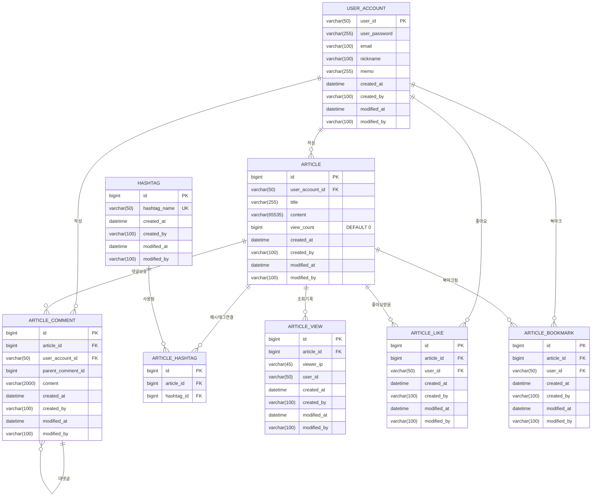

# Project Board ERD

## 개체 관계 다이어그램 (Entity Relationship Diagram)

## 주요 변경사항 (v2.0)

### 새로 추가된 테이블

1. **ARTICLE_VIEW**: 게시글 조회 추적

   - IP와 사용자 ID 기반 24시간 중복 조회 방지
   - 조회수 계산을 위한 기록 보관

2. **ARTICLE_LIKE**: 게시글 좋아요 관계

   - 사용자와 게시글 간의 좋아요 관계 매핑
   - 복합 유니크 제약조건 (article_id, user_id)

3. **ARTICLE_BOOKMARK**: 게시글 북마크 관계
   - 사용자와 게시글 간의 북마크 관계 매핑
   - 복합 유니크 제약조건 (article_id, user_id)

### 기존 테이블 변경사항

- **ARTICLE**: `view_count` 필드 추가 (기본값 0)

## 인덱스 및 제약조건

### 성능 최적화를 위한 인덱스

- `ARTICLE_VIEW`: article_id, viewer_ip, user_id, created_at
- `ARTICLE_LIKE`: article_id, user_id, created_at
- `ARTICLE_BOOKMARK`: article_id, user_id, created_at

### 데이터 무결성을 위한 제약조건

- 각 상호작용 테이블의 복합 유니크 제약조건으로 중복 방지
- 외래키 제약조건으로 참조 무결성 보장
