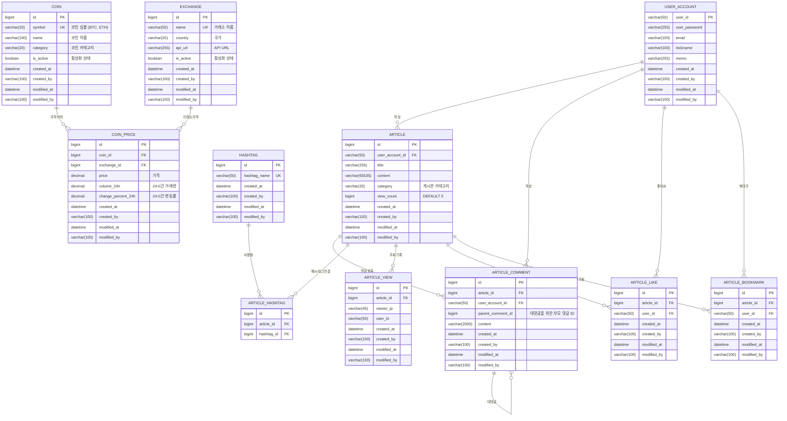

# Project Board ERD v3.0

## 개체 관계 다이어그램 (Entity Relationship Diagram)

## 버전별 변경사항

### v3.0 - 암호화폐 통합 기능 (2025.10)

#### 새로 추가된 테이블

1. **COIN**: 암호화폐 정보
   - 코인 심볼, 이름, 카테고리 관리
   - 활성화 상태 플래그

2. **EXCHANGE**: 거래소 정보
   - 거래소 이름, 국가, API URL 관리
   - 활성화 상태 플래그

3. **COIN_PRICE**: 암호화폐 가격 이력
   - 거래소별 코인 가격 추적
   - 24시간 거래량 및 변동률 저장
   - 실시간 시세 데이터 보관

#### 기존 테이블 변경사항

- **ARTICLE**: `category` 필드 추가 (GENERAL, CRYPTO)
- **ARTICLE_COMMENT**: `parent_comment_id` 필드 추가 (대댓글 지원)

### v2.0 - 상호작용 기능 (2025.6)

#### 새로 추가된 테이블

1. **ARTICLE_VIEW**: 게시글 조회 추적
   - IP와 사용자 ID 기반 24시간 중복 조회 방지
   - 조회수 계산을 위한 기록 보관

2. **ARTICLE_LIKE**: 게시글 좋아요 관계
   - 사용자와 게시글 간의 좋아요 관계 매핑
   - 복합 유니크 제약조건 (article_id, user_id)

3. **ARTICLE_BOOKMARK**: 게시글 북마크 관계
   - 사용자와 게시글 간의 북마크 관계 매핑
   - 복합 유니크 제약조건 (article_id, user_id)

#### 기존 테이블 변경사항

- **ARTICLE**: `view_count` 필드 추가 (기본값 0)

## 인덱스 및 제약조건

### 성능 최적화를 위한 인덱스

- `ARTICLE`: category, view_count, created_at
- `ARTICLE_VIEW`: article_id, viewer_ip, user_id, created_at
- `ARTICLE_LIKE`: article_id, user_id, created_at
- `ARTICLE_BOOKMARK`: article_id, user_id, created_at
- `COIN_PRICE`: coin_id, exchange_id, created_at
- `COIN`: symbol (UNIQUE)
- `EXCHANGE`: name (UNIQUE)

### 데이터 무결성을 위한 제약조건

- 각 상호작용 테이블의 복합 유니크 제약조건으로 중복 방지
- 외래키 제약조건으로 참조 무결성 보장
- COIN의 symbol UNIQUE 제약조건
- EXCHANGE의 name UNIQUE 제약조건
- COIN_PRICE의 복합 인덱스 (coin_id, exchange_id, created_at)

## 테이블 용도 및 설명

### 게시판 관련 테이블

- **ARTICLE**: 게시글 본문 및 메타데이터
- **ARTICLE_COMMENT**: 댓글 및 대댓글
- **HASHTAG**: 게시글 태그
- **ARTICLE_HASHTAG**: 게시글-해시태그 다대다 관계

### 사용자 상호작용 테이블

- **ARTICLE_VIEW**: 조회수 추적 (중복 방지)
- **ARTICLE_LIKE**: 좋아요 관계
- **ARTICLE_BOOKMARK**: 북마크 관계

### 암호화폐 관련 테이블

- **COIN**: 암호화폐 마스터 데이터
- **EXCHANGE**: 거래소 마스터 데이터
- **COIN_PRICE**: 실시간 가격 및 거래 데이터
