# Project Board Use-Case Diagram

## 유스케이스 다이어그램 (Use-Case Diagram)

```mermaid
graph TB
    %% Actors
    User([👤 이용자])
    Guest([🔓 비회원])
    Member([🔐 회원])
    KakaoAuth[🏢 카카오 인증 서버]
    NaverAuth[🏢 네이버 인증 서버]
    DB[(🗄️ 데이터베이스)]

    %% Use Cases - 인증 관련
    UC1[로그인]
    UC2[OAuth 로그인]
    UC3[로그아웃]

    %% Use Cases - 게시판 기본 기능
    UC4[게시판 목록 보기]
    UC5[게시글 보기]
    UC6[게시글 작성]
    UC7[게시글 수정]
    UC8[게시글 삭제]
    UC9[게시글 검색]
    UC10[게시판 정렬]

    %% Use Cases - 댓글 기능
    UC11[댓글 보기]
    UC12[댓글 작성]
    UC13[댓글 수정]
    UC14[댓글 삭제]
    UC15[대댓글 작성]

    %% Use Cases - 새로 추가된 상호작용 기능
    UC16[게시글 좋아요]
    UC17[게시글 북마크]
    UC18[북마크 목록 보기]
    UC19[조회수 확인]

    %% Use Cases - 해시태그
    UC20[해시태그 검색]
    UC21[해시태그 게시판 보기]

    %% Relationships - Guest (비회원)
    Guest --> UC4
    Guest --> UC5
    Guest --> UC11
    Guest --> UC9
    Guest --> UC10
    Guest --> UC19
    Guest --> UC20
    Guest --> UC21
    Guest --> UC1

    %% Relationships - Member (회원)
    Member --> UC4
    Member --> UC5
    Member --> UC6
    Member --> UC7
    Member --> UC8
    Member --> UC9
    Member --> UC10
    Member --> UC11
    Member --> UC12
    Member --> UC13
    Member --> UC14
    Member --> UC15
    Member --> UC16
    Member --> UC17
    Member --> UC18
    Member --> UC19
    Member --> UC20
    Member --> UC21
    Member --> UC3

    %% Include relationships (필수 관계)
    UC6 -.->|include| UC1
    UC7 -.->|include| UC1
    UC8 -.->|include| UC1
    UC12 -.->|include| UC1
    UC13 -.->|include| UC1
    UC14 -.->|include| UC1
    UC15 -.->|include| UC1
    UC16 -.->|include| UC1
    UC17 -.->|include| UC1
    UC18 -.->|include| UC1

    %% Extend relationships (선택적 관계)
    UC2 -.->|extend| UC1
    UC15 -.->|extend| UC12
    UC16 -.->|extend| UC5
    UC17 -.->|extend| UC5

    %% External system connections
    UC2 --> KakaoAuth
    UC2 --> NaverAuth

    %% Database connections
    UC1 --> DB
    UC4 --> DB
    UC5 --> DB
    UC6 --> DB
    UC7 --> DB
    UC8 --> DB
    UC9 --> DB
    UC11 --> DB
    UC12 --> DB
    UC13 --> DB
    UC14 --> DB
    UC15 --> DB
    UC16 --> DB
    UC17 --> DB
    UC18 --> DB
    UC19 --> DB
    UC20 --> DB
    UC21 --> DB

    %% User generalization
    User --> Guest
    User --> Member

    %% Styling
    classDef actorStyle fill:#e1f5fe,stroke:#01579b,stroke-width:2px
    classDef useCaseStyle fill:#f3e5f5,stroke:#4a148c,stroke-width:2px
    classDef systemStyle fill:#fff3e0,stroke:#e65100,stroke-width:2px
    classDef newFeatureStyle fill:#e8f5e8,stroke:#2e7d32,stroke-width:3px

    class User,Guest,Member actorStyle
    class UC1,UC2,UC3,UC4,UC5,UC6,UC7,UC8,UC9,UC10,UC11,UC12,UC13,UC14,UC15,UC20,UC21 useCaseStyle
    class UC16,UC17,UC18,UC19 newFeatureStyle
    class KakaoAuth,NaverAuth,DB systemStyle
```

## 주요 변경사항 (v2.0)

### 새로 추가된 Use Cases

1. **게시글 좋아요 (UC16)**

   - **Actor**: 회원
   - **설명**: 게시글에 좋아요/좋아요 취소 가능
   - **관계**: 게시글 보기의 확장 기능, 로그인 필수

2. **게시글 북마크 (UC17)**

   - **Actor**: 회원
   - **설명**: 게시글을 개인 북마크에 저장/해제
   - **관계**: 게시글 보기의 확장 기능, 로그인 필수

3. **북마크 목록 보기 (UC18)**

   - **Actor**: 회원
   - **설명**: 사용자가 북마크한 게시글 목록 조회
   - **관계**: 로그인 필수

4. **조회수 확인 (UC19)**
   - **Actor**: 모든 사용자 (비회원 포함)
   - **설명**: 게시글 및 목록에서 조회수 확인
   - **특징**: IP와 사용자 기반 24시간 중복 방지

### 기존 기능 확장

- **게시글 보기**: 좋아요, 북마크 기능이 확장 관계로 추가
- **로그인**: 상호작용 기능들의 필수 요구사항

### Actor 세분화

- **이용자**: 최상위 액터
  - **비회원**: 조회 전용 기능
  - **회원**: 모든 기능 이용 가능

### 시스템 통합

- **OAuth 인증 서버**: Kakao, Naver 연동
- **데이터베이스**: 모든 데이터 저장 및 조회

## 기능별 권한 매트릭스

| 기능                  | 비회원 | 회원 | 인증 필요 |
| --------------------- | ------ | ---- | --------- |
| 게시판/게시글 조회    | ✅     | ✅   | ❌        |
| 조회수 확인           | ✅     | ✅   | ❌        |
| 검색/정렬             | ✅     | ✅   | ❌        |
| 게시글 작성/수정/삭제 | ❌     | ✅   | ✅        |
| 댓글 작성/수정/삭제   | ❌     | ✅   | ✅        |
| 좋아요                | ❌     | ✅   | ✅        |
| 북마크                | ❌     | ✅   | ✅        |
| 북마크 목록           | ❌     | ✅   | ✅        |
