# Project Board Use-Case Diagram v3.0

## 유스케이스 다이어그램 (Use-Case Diagram)

```mermaid
graph TB
    %% Actors
    User([👤 이용자])
    Guest([🔓 비회원])
    Member([🔐 회원])
    KakaoAuth[🏢 카카오 인증 서버]
    NaverAuth[🏢 네이버 인증 서버]
    UpbitAPI[🏢 Upbit API]
    BinanceAPI[🏢 Binance API]
    BithumbAPI[🏢 Bithumb API]
    ExchangeRateAPI[🏢 환율 API]
    DB[(🗄️ 데이터베이스)]

    %% Use Cases - 인증 관련
    UC1[로그인]
    UC2[OAuth 로그인]
    UC3[로그아웃]

    %% Use Cases - 게시판 기본 기능
    UC4[게시판 목록 보기]
    UC5[게시글 보기]
    UC6[게시글 작성]
    UC7[게시글 수정]
    UC8[게시글 삭제]
    UC9[게시글 검색]
    UC10[게시판 정렬]

    %% Use Cases - 댓글 기능
    UC11[댓글 보기]
    UC12[댓글 작성]
    UC13[댓글 수정]
    UC14[댓글 삭제]
    UC15[대댓글 작성]

    %% Use Cases - 상호작용 기능
    UC16[게시글 좋아요]
    UC17[게시글 북마크]
    UC18[북마크 목록 보기]
    UC19[조회수 확인]

    %% Use Cases - 해시태그
    UC20[해시태그 검색]
    UC21[해시태그 게시판 보기]

    %% Use Cases - 암호화폐 기능
    UC22[실시간 시세 조회]
    UC23[김치 프리미엄 조회]
    UC24[코인 선택/관리]
    UC25[암호화폐 게시판 보기]
    UC26[코인별 게시판 보기]

    %% Relationships - Guest (비회원)
    Guest --> UC4
    Guest --> UC5
    Guest --> UC11
    Guest --> UC9
    Guest --> UC10
    Guest --> UC19
    Guest --> UC20
    Guest --> UC21
    Guest --> UC1
    Guest --> UC22
    Guest --> UC23
    Guest --> UC25
    Guest --> UC26

    %% Relationships - Member (회원)
    Member --> UC4
    Member --> UC5
    Member --> UC6
    Member --> UC7
    Member --> UC8
    Member --> UC9
    Member --> UC10
    Member --> UC11
    Member --> UC12
    Member --> UC13
    Member --> UC14
    Member --> UC15
    Member --> UC16
    Member --> UC17
    Member --> UC18
    Member --> UC19
    Member --> UC20
    Member --> UC21
    Member --> UC3
    Member --> UC22
    Member --> UC23
    Member --> UC24
    Member --> UC25
    Member --> UC26

    %% Include relationships (필수 관계)
    UC6 -.->|include| UC1
    UC7 -.->|include| UC1
    UC8 -.->|include| UC1
    UC12 -.->|include| UC1
    UC13 -.->|include| UC1
    UC14 -.->|include| UC1
    UC15 -.->|include| UC1
    UC16 -.->|include| UC1
    UC17 -.->|include| UC1
    UC18 -.->|include| UC1

    %% Extend relationships (선택적 관계)
    UC2 -.->|extend| UC1
    UC15 -.->|extend| UC12
    UC16 -.->|extend| UC5
    UC17 -.->|extend| UC5
    UC24 -.->|extend| UC23

    %% External system connections - 인증
    UC2 --> KakaoAuth
    UC2 --> NaverAuth

    %% External system connections - 암호화폐
    UC22 --> UpbitAPI
    UC22 --> BinanceAPI
    UC22 --> BithumbAPI
    UC23 --> UpbitAPI
    UC23 --> BinanceAPI
    UC23 --> ExchangeRateAPI

    %% Database connections
    UC1 --> DB
    UC4 --> DB
    UC5 --> DB
    UC6 --> DB
    UC7 --> DB
    UC8 --> DB
    UC9 --> DB
    UC11 --> DB
    UC12 --> DB
    UC13 --> DB
    UC14 --> DB
    UC15 --> DB
    UC16 --> DB
    UC17 --> DB
    UC18 --> DB
    UC19 --> DB
    UC20 --> DB
    UC21 --> DB
    UC25 --> DB
    UC26 --> DB
```

## 버전별 변경사항

### v3.0 - 암호화폐 통합 기능 (2025.10)

#### 새로 추가된 Use Case

1. **UC22 - 실시간 시세 조회**
   - Actor: 비회원, 회원
   - 외부 시스템: Upbit API, Binance API, Bithumb API
   - 설명: WebSocket을 통한 실시간 암호화폐 가격 조회

2. **UC23 - 김치 프리미엄 조회**
   - Actor: 비회원, 회원
   - 외부 시스템: Upbit API, Binance API, 환율 API
   - 설명: 국내외 거래소 가격 차이 및 프리미엄율 계산

3. **UC24 - 코인 선택/관리**
   - Actor: 회원
   - 설명: 사용자 커스텀 코인 목록 관리 (최대 6개)
   - Extend: UC23 (김치 프리미엄 조회의 확장 기능)

4. **UC25 - 암호화폐 게시판 보기**
   - Actor: 비회원, 회원
   - 데이터베이스: 암호화폐 카테고리 게시글 조회
   - 설명: 암호화폐 전용 게시판 목록 조회

5. **UC26 - 코인별 게시판 보기**
   - Actor: 비회원, 회원
   - 데이터베이스: 특정 코인 관련 게시글 조회
   - 설명: 특정 암호화폐(BTC, ETH 등)별 게시판 조회

#### 새로 추가된 외부 시스템

- **Upbit API**: 국내 암호화폐 거래소 API
- **Binance API**: 국제 암호화폐 거래소 API
- **Bithumb API**: 국내 암호화폐 거래소 API
- **환율 API**: USD/KRW 환율 정보 API

### v2.0 - 상호작용 기능 (2025.6)

#### 추가된 Use Case

1. **UC16 - 게시글 좋아요**
   - Actor: 회원
   - Include: UC1 (로그인 필수)
   - Extend: UC5 (게시글 보기의 확장 기능)

2. **UC17 - 게시글 북마크**
   - Actor: 회원
   - Include: UC1 (로그인 필수)
   - Extend: UC5 (게시글 보기의 확장 기능)

3. **UC18 - 북마크 목록 보기**
   - Actor: 회원
   - Include: UC1 (로그인 필수)

4. **UC19 - 조회수 확인**
   - Actor: 비회원, 회원
   - 설명: 24시간 중복 방지 기반 조회수 추적

## Use Case 상세 설명

### 인증 관련

- **UC1 - 로그인**: 일반 로그인 기능
- **UC2 - OAuth 로그인**: 소셜 로그인 (Kakao, Naver)
- **UC3 - 로그아웃**: 세션 종료

### 게시판 기본 기능

- **UC4 - 게시판 목록 보기**: 게시글 목록 조회 (페이지네이션)
- **UC5 - 게시글 보기**: 게시글 상세 조회
- **UC6 - 게시글 작성**: 새 게시글 작성 (로그인 필요)
- **UC7 - 게시글 수정**: 본인 게시글 수정 (로그인 필요)
- **UC8 - 게시글 삭제**: 본인 게시글 삭제 (로그인 필요)
- **UC9 - 게시글 검색**: 제목, 내용, 작성자, 해시태그 검색
- **UC10 - 게시판 정렬**: 최신순, 조회수순, 좋아요순 정렬

### 댓글 기능

- **UC11 - 댓글 보기**: 게시글의 댓글 목록 조회
- **UC12 - 댓글 작성**: 새 댓글 작성 (로그인 필요)
- **UC13 - 댓글 수정**: 본인 댓글 수정 (로그인 필요)
- **UC14 - 댓글 삭제**: 본인 댓글 삭제 (로그인 필요)
- **UC15 - 대댓글 작성**: 댓글에 대한 답글 작성 (UC12 확장)

### 상호작용 기능

- **UC16 - 게시글 좋아요**: Ajax 기반 실시간 좋아요/취소
- **UC17 - 게시글 북마크**: 개인 북마크 저장/해제
- **UC18 - 북마크 목록 보기**: 사용자별 북마크 게시글 조회
- **UC19 - 조회수 확인**: IP/사용자 기반 24시간 중복 방지

### 해시태그 기능

- **UC20 - 해시태그 검색**: 해시태그로 게시글 검색
- **UC21 - 해시태그 게시판 보기**: 특정 해시태그 게시글 목록

### 암호화폐 기능

- **UC22 - 실시간 시세 조회**: WebSocket 실시간 가격 업데이트
- **UC23 - 김치 프리미엄 조회**: 국내외 가격 차이 계산
- **UC24 - 코인 선택/관리**: 사용자별 관심 코인 설정
- **UC25 - 암호화폐 게시판 보기**: 암호화폐 카테고리 게시판
- **UC26 - 코인별 게시판 보기**: 특정 코인 전용 게시판
